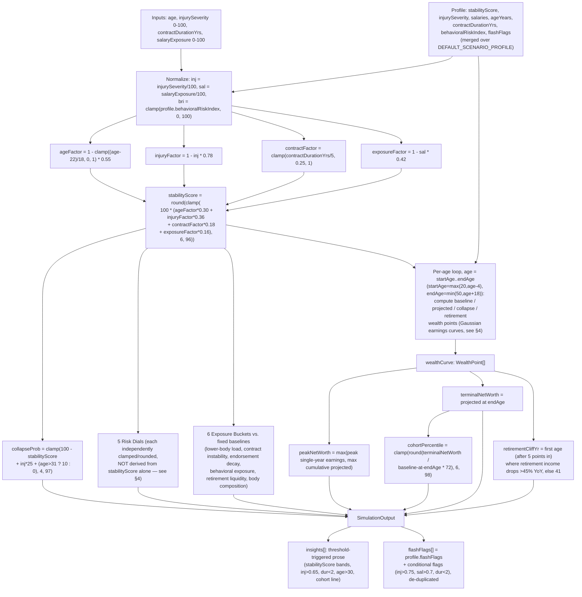

# ATHLIX AI — Architecture

Reference document for how the app is put together: folder map, the three
core request flows (search, dashboard SSR, chat), the scenario-engine
formulas as they actually exist in code, the full configuration surface, and
the test layout. Written from a read of the entire `real-data` branch as of
commit `0f0bf27`.

See also: `README.md` (product framing, run instructions),
`docs/PROJECT-NOTES.md` (real-vs-assumption ledger, live verification log),
`app/methodology/page.tsx` (user-facing formula summary — a subset of what's
documented here), `docs/CODE-AUDIT.md` (companion audit of weak spots).

---

## 1. Folder map

```
athlix-ai/
├── app/                              Next.js App Router
│   ├── page.tsx                      Landing page: ticker, search, feature grid, dashboard preview
│   ├── layout.tsx                    Root layout — fonts (Geist), metadata, viewport
│   ├── template.tsx                  Wraps every route in PageFade; remounts subtree on pathname change
│   ├── globals.css                   Design tokens (glass-card, neon-border, glow-button, etc.)
│   ├── methodology/page.tsx          Static page: what's real data vs. modeling assumption, printed formulas
│   ├── dashboard/
│   │   ├── page.tsx                  Cohort index — grid of the 5 curated PLAYERS
│   │   └── [player]/page.tsx         Server component: resolves curated-or-live profile, SSR's live stats
│   └── api/
│       ├── players/search/route.ts   GET — BALLDONTLIE search proxy (rate-limited, zod-validated)
│       └── chat/route.ts             POST — streaming chat proxy (rate-limited, zod-validated)
├── components/
│   ├── landing/                      athlete-search, ticker, atmosphere, topbar, feature-grid, dashboard-preview
│   ├── dashboard/                    dashboard-shell (page composition), simulator, player-hero,
│   │                                 live-stats-card, stability-score, risk-dial-card
│   ├── charts/                       wealth-chart, risk-radar, risk-tooltip (Recharts wrappers)
│   ├── ai/chat-panel.tsx             useChat-based floating chat widget
│   ├── motion/page-fade.tsx          Route-transition animation used by app/template.tsx
│   └── ui/                           Radix-based primitives: button, tabs, slider (used) +
│                                     card, badge, input, skeleton (not currently imported anywhere — see audit)
├── data/players.ts                   5 curated analyst profiles (PlayerProfile[]) + SUGGESTED_SLUGS
├── lib/
│   ├── balldontlie.ts                Server-only BALLDONTLIE REST client (hand-rolled fetch)
│   ├── live-stats.ts                 Assembles LiveStats (bio + recent games) from balldontlie.ts, or null
│   ├── scenario-engine.ts            simulate() + defaultInputsFor() — the deterministic formula core
│   ├── rate-limit.ts                 In-memory sliding-window limiter + clientKey() extractor
│   └── utils.ts                      cn, formatCurrency, formatPct, clamp, slugify
├── tests/                            6 vitest files, 38 tests (see §5)
├── docs/
│   └── PROJECT-NOTES.md              Engineering notes, real-vs-demo ledger, live verification transcripts
├── .github/workflows/ci.yml          install → lint → test → build, Node 20, empty secrets
├── AGENTS.md / CLAUDE.md             Repo-level agent instructions (CLAUDE.md just @-imports AGENTS.md)
├── meta.json                         Campaign metadata (title, description, repo/deploy URLs)
├── .env.example                      BALLDONTLIE_API_KEY, OPENROUTER_API_KEY (both server-only, both optional)
├── next.config.ts                    Empty — no custom Next config
├── vitest.config.ts                  node environment, "@/*" alias, tests/**/*.test.ts
└── package.json                      Next 16.2.6, React 19.2.4, AI SDK v6, Recharts 3, Tailwind v4
```

**Layering, top to bottom:** `app/*` (routes, server components, route
handlers) → `components/*` (client UI, one level of composition:
`dashboard-shell.tsx` is the single composition root for the whole player
page) → `lib/*` (pure/server-only logic, no React) → `data/players.ts`
(static fixtures). Nothing in `lib/` imports from `components/` or `app/`;
the dependency arrow only points downward.

---

## 2. Flow: search-as-you-type (with rate limiting)

`components/landing/athlete-search.tsx` → `app/api/players/search/route.ts`
→ `lib/balldontlie.ts` → BALLDONTLIE.

```mermaid
sequenceDiagram
    participant U as User
    participant AS as AthleteSearch (client component)
    participant API as GET /api/players/search
    participant RL as rate-limit.ts (30 req / 60s per client)
    participant BDL as lib/balldontlie.ts
    participant EXT as BALLDONTLIE API

    U->>AS: types in the search input
    Note over AS: useEffect debounces 250ms;<br/>all state writes happen inside<br/>the setTimeout callback, not the<br/>effect body (avoids render cascades)
    AS->>AS: abort previous in-flight request (AbortController)
    alt query < 2 chars
        AS->>AS: setResults([]) — no network call
    else query >= 2 chars
        AS->>API: fetch `/api/players/search?q=...` (signal: controller.signal)
        API->>RL: check(clientKey(req))
        alt over limit
            RL-->>API: {ok:false, retryAfterSeconds}
            API-->>AS: 429 + Retry-After header
            Note over AS: not specially handled client-side —<br/>falls into the generic !res.ok branch,<br/>results cleared, no retry-after UI
        else within limit
            API->>API: isConfigured() — is BALLDONTLIE_API_KEY set?
            alt not configured
                API-->>AS: 503 { error: "live_search_unavailable" }
                AS->>AS: setOffline(true), setResults([])
            else configured
                API->>API: zod: 2 <= q.length <= 40
                alt invalid
                    API-->>AS: 400 { error: "invalid_query" }
                else valid
                    API->>BDL: searchPlayers(q, perPage=8)
                    BDL->>EXT: GET /players?search=q&per_page=8 (Authorization header, next.revalidate=300s)
                    EXT-->>BDL: { data: BdlPlayer[] }
                    BDL-->>API: BdlPlayer[]
                    API-->>AS: 200 { data: [{id, name, slug, position, team}], source: "balldontlie" }
                    AS->>AS: setOffline(false), setResults(data)
                end
            end
        end
    end
    AS-->>U: renders live matches, "no matches", offline banner, or curated PLAYERS fallback (unfocused/empty query)
    U->>AS: Enter / click a result
    AS->>AS: router.push(`/dashboard/{slug}?bdl={id}`)
```

Key details:
- The rate limiter key is `clientKey(req)` — first entry of `X-Forwarded-For`,
  falling back to `X-Real-IP`, falling back to the literal string
  `"anonymous"`. See `docs/CODE-AUDIT.md` for why this is spoofable.
- Rate limiting and the `isConfigured()` check happen in that order — a
  client that floods the endpoint gets 429s even with no key configured.
- The search route always slugifies names with `slugify()` from `lib/utils.ts`
  so the client can build a `/dashboard/{slug}` URL without a second lookup.

---

## 3. Flow: scenario-engine computation

`lib/scenario-engine.ts` exports one pure function, `simulate(profile, inputs)`,
called from `components/dashboard/dashboard-shell.tsx` inside a `useMemo`
keyed on `[player, inputs]`, and again (statically, at module load) from
`components/landing/dashboard-preview.tsx` for the landing-page preview card.
It is fully deterministic: no `Math.random`, no dates, no I/O — same
`(profile, inputs)` pair always produces a structurally identical output
(`tests/scenario-engine.test.ts` asserts this with `toEqual`).



The dashboard re-runs `simulate()` on every slider change (client-side,
synchronous, no debounce needed since it's pure computation, not I/O) — this
is why the UI can claim "auto-refresh" / "live recompute" without any network
round trip.

---

## 4. The formulas, transcribed from code (not just the methodology page)

`app/methodology/page.tsx` prints the `stabilityScore` / `collapseProb`
formulas for users. This section documents *all* of them, matching
`lib/scenario-engine.ts` line-for-line as of `0f0bf27`.

### 4.1 Core factors and stability score

```
inj = injurySeverity / 100          # 0..1
sal = salaryExposure / 100          # 0..1
bri = clamp(profile.behavioralRiskIndex, 0, 100)

ageFactor      = 1 - clamp((age - 22) / 18, 0, 1) * 0.55
injuryFactor   = 1 - inj * 0.78
contractFactor = clamp(contractDurationYrs / 5, 0.25, 1)
exposureFactor = 1 - sal * 0.42

stabilityScore = round(clamp(
    100 * (ageFactor * 0.30 + injuryFactor * 0.36
         + contractFactor * 0.18 + exposureFactor * 0.16),
    6, 96))

collapseProb = clamp(
    100 - stabilityScore + inj * 25 + (age > 31 ? 10 : 0),
    4, 97)
```

Weights sum to 1.00 (0.30 + 0.36 + 0.18 + 0.16). Injury severity is the
heaviest-weighted single factor (0.36), followed by age (0.30).

### 4.2 Wealth curve (per age, from `startAge = max(20, age-4)` to `endAge = min(50, age+18)`)

```
peakBase = baseSalaryUsd + endorsementsUsd
peakAge  = clamp(age + 3 - inj*3, 24, 31)

# Baseline (synthetic cohort, ignores this player's injury/salary inputs):
bGauss           = exp(-((a-27)/6.5)^2)
baselineEarnings = peakBase * (0.35 + 1.05*bGauss)
cumulativeBaseline += baselineEarnings * 0.78     # running sum → WealthPoint.baseline

# Projected (this player, injury+age decay after peak):
pGauss    = exp(-((a-peakAge)/(5.5 - inj*1.6))^2)
decay     = a > peakAge ? (1 - inj*0.12)^(a-peakAge) : 1
projected = peakBase * (0.32 + 1.0*pGauss) * decay * (1 - sal*0.12)
cumulative += projected * 0.74                    # running sum → WealthPoint.projected

# Collapse scenario (steeper decay, contract non-renewal):
cDecay   = a > peakAge-1 ? (0.78 + inj*0.05)^(a-(peakAge-1)) : 1
collapse = peakBase * (0.28 + 0.85*pGauss) * cDecay * 0.62
cumulativeCollapse += collapse * 0.66             # running sum → WealthPoint.collapse

# Retirement liquidity (post-career income, only accrues after age 32):
retireMod = a > 32 ? clamp((a-32)/14, 0, 1) : 0
retirement = cumulative * 0.05 * (1 - retireMod * (0.6 + inj*0.25))   # → WealthPoint.retirement
```

All three of baseline/projected/collapse are *cumulative* sums across the
age range (not per-year income) — the chart's Y-axis is career wealth
accumulated to date, not annual earnings.

```
peakNetWorth      = max(single-year peak `projected` earnings, max cumulative `projected` over the curve)
terminalNetWorth  = projected value at the last age in the curve
retirementCliffYr = first age (index > 4) where retirement < 0.55 * previous year's retirement, else 41
cohortPercentile  = clamp(round(terminalNetWorth / baseline-at-endAge * 72), 6, 98)
```

### 4.3 Risk dials (5) — each is its own transform, not a slice of `stabilityScore`

| Dial | value | delta | tier |
|---|---|---|---|
| Career Stability | `stabilityScore` | `stabilityScore - profile.stabilityScore` | `tierFromScore(stabilityScore)` |
| Injury Risk | `clamp(inj*100 + (age-25)*1.3, 4, 98)` | `round((inj*100 - profile.injurySeverity) * 0.5)` | `tierFromScore(100 - injuryRiskValue)` |
| Behavioral Volatility | `clamp(bri + sal*14 - (stabilityScore-60)*0.4, 5, 96)` | `round(sal*8 - 4)` | `bri >= 65 ? "VOLATILE" : tierFromScore(stabilityScore+8)` |
| Earning Compression | `clamp((100-stabilityScore)*0.7 + (age>30?18:4), 5, 95)` | `round((100-stabilityScore-40)*0.4)` | `tierFromScore(stabilityScore-5)` |
| Retirement Collapse | `clamp(collapseProb*0.78 + (dur<2?14:0), 5, 96)` | `round(collapseProb*0.1 - 5)` | `tierFromScore(100-collapseProb)` |

`tierFromScore(score)`: `<35` → CRITICAL, `<55` → VOLATILE, `<75` → ELEVATED,
else STABLE. This is the *canonical* tier mapping in the engine — see
`docs/CODE-AUDIT.md` for the five other places this same 4-way mapping is
independently reimplemented in the UI layer.

### 4.4 Exposure buckets (6) — `{category, exposure, baseline}`

| Category | exposure formula | fixed baseline |
|---|---|---|
| Lower-body load | `clamp(inj*95 + 5, 8, 98)` | 38 |
| Contract instability | `clamp(100 - dur*18 + sal*22, 6, 96)` | 35 |
| Endorsement decay | `clamp(60 - stabilityScore*0.4 + sal*14, 8, 92)` | 32 |
| Behavioral exposure | `clamp(bri*0.95 + sal*12, 6, 92)` | 30 |
| Retirement liquidity | `clamp(95 - stabilityScore*0.9, 8, 96)` | 40 |
| Body composition | `clamp(inj*80 + (age-24)*2, 8, 95)` | 30 |

The `baseline` values are hardcoded constants, not derived from anything —
they exist only to draw the reference line in `RiskRadar` / the bucket bars.

### 4.5 Insights and flash flags

`insights[]` is built by appending fixed-template strings when thresholds
trip (`stabilityScore` bands, `inj > 0.65`, `dur < 2`, `age > 30`), plus a
final line that always prints the cohort percentile and terminal net worth.
`flashFlags[]` starts from `profile.flashFlags` (curated, per-player) and
appends `"Acute injury exposure"` / `"Salary cap risk"` / `"Contract expiry
imminent"` when `inj > 0.75` / `sal > 0.7` / `dur < 2`, then de-duplicates
with `Set`.

### 4.6 `defaultInputsFor(profile)`

Derives initial slider positions from a profile: `age = ageYears`,
`injurySeverity = profile.injurySeverity`, `contractDurationYrs =
profile.contractDurationYrs`, and `salaryExposure = min(95, round
(baseSalaryUsd / estContractValueUsd * 100 * 4))` — an arbitrary 4x
amplification of the raw salary/contract-value ratio, capped at 95.

---

## 5. Flow: chat streaming

`components/ai/chat-panel.tsx` (via `useChat` + `DefaultChatTransport`) →
`app/api/chat/route.ts` → OpenRouter (DeepSeek) or a canned demo stream.

```mermaid
sequenceDiagram
    participant U as User
    participant CP as ChatPanel (useChat)
    participant API as POST /api/chat (runtime=nodejs, maxDuration=30)
    participant RL as rate-limit.ts (20 req / 60s per client)
    participant OR as OpenRouter (deepseek/deepseek-chat)

    U->>CP: submit(text) or click a suggested query
    CP->>API: POST { messages: UIMessage[], context: aiContext } (context rebuilt via useMemo on every sim/input change)
    API->>RL: check(clientKey(req))
    alt over limit
        RL-->>CP: 429 + Retry-After
    else within limit
        API->>API: req.json() — catch parse errors → 400 invalid_json
        API->>API: zod bodySchema.safeParse(messages 1..100, parts <=200, context <=4000)
        alt invalid
            API-->>CP: 400 invalid_request
        else valid
            alt OPENROUTER_API_KEY unset
                API->>API: buildDemoStream(messages, context)
                Note over API: keyword-matches last user message<br/>(collapse/retire, contract/stability, injury/stress/test, default)<br/>emits a labeled "[DEMO MODE]" canned reply,<br/>chunked ~18 chars at a time with 18ms delay,<br/>as a hand-built SSE UI-message-stream
                API-->>CP: 200 text/plain SSE stream
            else key set
                API->>OR: streamText({ model, messages: convertToModelMessages(messages),\n  system: SYSTEM + "\n\n=== ACTIVE CONTEXT ===\n" + context })
                OR-->>API: token stream
                API-->>CP: result.toUIMessageStreamResponse()
            end
            CP->>CP: append text-delta parts as they arrive; autoscroll on messages/status change
        end
    end
```

Key details:
- `context` is a single string assembled in `dashboard-shell.tsx`
  (`aiContext`) summarizing player, tier scores, current slider inputs, and
  flash flags — recomputed via `useMemo([player, sim, inputs])` and sent on
  *every* chat POST (the transport's `body: () => ({ context })` callback
  re-reads it fresh each call, not just at panel-open time).
- The system prompt (`SYSTEM` constant) explicitly instructs the model to
  describe outputs as "scenario outputs, never as forecasts," to avoid
  gambling/fantasy framing, and to disclaim financial advice.
- No fetch timeout is set around `streamText()` itself; `maxDuration = 30`
  is a Vercel/Next route-segment config (max function duration), not a
  client-facing abort — see `docs/CODE-AUDIT.md`.

---

## 6. Dashboard page composition (non-chat, non-search parts)

`app/dashboard/[player]/page.tsx` (server component) resolves the player two
ways:
1. **Curated**: `getPlayerBySlug(slug)` hits one of the 5 hand-authored
   profiles in `data/players.ts` — used as-is.
2. **Live/scenario fallback**: if no curated match, `scenarioProfile(slug,
   live)` builds a `PlayerProfile` where bio fields (team, position,
   height/weight, jersey, college, country) come from `getLiveStats()`
   (real BALLDONTLIE data) when available, and all *financial* fields
   (salary, guarantees, endorsements, contract value, injury severity,
   behavioral risk index) are fixed documented defaults — never derived from
   the live record.

Either way, the resolved `PlayerProfile` and the (possibly null) `LiveStats`
are passed into `<DashboardShell player={...} live={...} />`, a client
component that owns all interactive state:

- `inputs: SimulatorInputs` — `useState`, initialized from
  `defaultInputsFor(player)`, mutated by `<Simulator>`'s sliders and presets.
- `sim: SimulationOutput` — `useMemo([player, inputs])`, recomputed on every
  input change; this is the single source of truth every card/chart/tab
  reads from.
- `aiContext: string` — `useMemo([player, sim, inputs])`, fed to `<ChatPanel>`.

Because `[player].page.tsx` is a Server Component re-rendered fresh on every
navigation (and `app/template.tsx` keys the page subtree by `pathname`,
forcing a full remount via `AnimatePresence`), `DashboardShell`'s local state
always starts clean for a new player — there is no client-side
soft-navigation path between two different player slugs that would leave
stale slider state behind. See `docs/CODE-AUDIT.md` for why this coupling is
worth flagging even though it currently works.

---

## 7. Configuration surface

| Surface | Value | Where |
|---|---|---|
| `BALLDONTLIE_API_KEY` | server-only, optional; missing → search 503s, live stats return null | `lib/balldontlie.ts`, `.env.example` |
| `OPENROUTER_API_KEY` | server-only, optional; missing → chat serves labeled demo stream | `app/api/chat/route.ts`, `.env.example` |
| No `NEXT_PUBLIC_*` vars | intentional — nothing secret is bundled to the client | repo-wide |
| Search rate limit | 30 requests / 60,000ms per `clientKey()` | `app/api/players/search/route.ts` |
| Chat rate limit | 20 requests / 60,000ms per `clientKey()` | `app/api/chat/route.ts` |
| Rate-limiter key extraction | first `X-Forwarded-For` entry → `X-Real-IP` → `"anonymous"` | `lib/rate-limit.ts` |
| Rate-limiter memory bound | drops oldest tracked key past 5,000 keys (`MAX_TRACKED_KEYS`) | `lib/rate-limit.ts` |
| BALLDONTLIE fetch cache | `next: { revalidate: 300 }` (5 min) on every `bdlFetch` call | `lib/balldontlie.ts` |
| Route runtime | `export const runtime = "nodejs"` on both API routes | `app/api/players/search/route.ts`, `app/api/chat/route.ts` |
| Chat max duration | `export const maxDuration = 30` (seconds, Vercel function limit) | `app/api/chat/route.ts` |
| Query validation | zod: search `q` 2–40 chars; chat `messages` 1–100 items, `parts` ≤200, `context` ≤4000 chars | route files |
| Path alias | `"@/*"` → repo root | `tsconfig.json`, `vitest.config.ts` |
| Test runtime | vitest, `environment: "node"`, `globals: true` | `vitest.config.ts` |
| Lint | `eslint-config-next` (core-web-vitals + typescript) | `eslint.config.mjs` |
| CI | Node 20, `npm ci` → lint → test → build; build runs with both keys explicitly set to `""` | `.github/workflows/ci.yml` |
| Next config | empty (`next.config.ts` has no overrides) | `next.config.ts` |
| Dashboard page rendering mode | `export const dynamic = "force-dynamic"` on `[player]/page.tsx` — always SSR, never statically cached | `app/dashboard/[player]/page.tsx` |

---

## 8. Test layout

`npm test` (Node 20; verified passing during this audit — 38/38): 6 files under `tests/`, mirroring `lib/` and the two API routes one-to-one. No test targets `components/` — all coverage is at the `lib/` and route-handler layer.

| File | Tests | Covers |
|---|---|---|
| `tests/scenario-engine.test.ts` | 6 | Determinism (`toEqual` on repeated calls), score/prob bounds across injury sweep, name-independence (byte-identical output for two profiles differing only by `name`), attribute-sensitivity (higher injury → lower stability), dial/bucket array lengths, `defaultInputsFor` derivation |
| `tests/balldontlie.test.ts` | 8 | `isConfigured` toggle, `currentSeason` month-boundary logic (Oct cutoff), `searchPlayers` short-circuit (<2 chars, no fetch), Authorization header + query serialization, `BdlError` on non-ok response and on missing key, `getRecentTeamGames` Final-only filter + newest-first sort |
| `tests/search-route.test.ts` | 4 | 503 when unkeyed, 400 on short query, happy-path mapping/slugify, 429 after 31 requests from one IP |
| `tests/chat-route.test.ts` | 5 | 400 on non-JSON body, 400 on empty `messages`, 400 on invalid `role`, labeled demo stream reassembly when unkeyed, 429 after 21 requests from one IP |
| `tests/rate-limit.test.ts` | 8 | Allow-up-to-limit, block-over-limit, remaining-budget accounting, sliding-window expiry, per-key isolation, `clientKey` header precedence (XFF first entry → X-Real-IP → "anonymous") |
| `tests/utils.test.ts` | 7 | `slugify` (lowercasing, punctuation stripping, whitespace collapsing), `clamp` bounds, `formatCurrency` compact/full, `formatPct` |

Each API-route test uses a distinct source IP per test case specifically to
avoid cross-test bleed through the shared module-level rate limiter (the
limiter state is *not* reset between tests — a deliberate choice documented
in a comment in `search-route.test.ts`).
